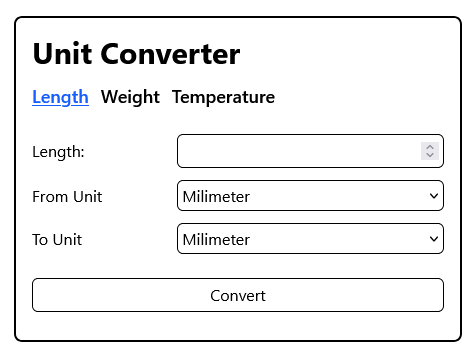
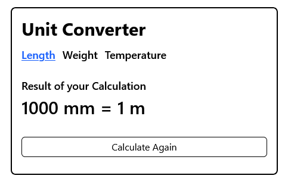

# Unit Converter PHP
A simple project for converting units of length, weight and temperature using PHP.
This project was created as a practice exercise for implementing conversion formulas in programming.

<p align="center">
       
       
</p>
 
## Features
- Length Conversion (Milimeter ↔ Centimeter ↔ Inch, etc)
- Weight Conversion (Gram ↔ Kilogram ↔ Pound, etc)
- Temperature Conversion (Celcius ↔ Fahrenheit ↔ Kelvin)
- Simple & Responsive Interface Build with Tailwind CSS

## Technology
- PHP 8+
- HTML
- [Tailwind 4.1.13](https://tailwindcss.com/)

## How to Run
1. Install [XAMPP](https://www.apachefriends.org/download.html)
2. Clone this repository into the `htdocs` folder:
       
       git clone https://github.com/BintangAF/Unit-Converter-with-PHP.git
       cd Unit-Converter-with-PHP
       npm install       
   
4. Start Apache from the XAMPP control panel
5. Open the project in browser:

    ```
    http://localhost/Unit-Converter-with-PHP
    ```

## Customize Interface
If you want to customize the design with Tailwind CSS, run the following command:

```
npx @tailwindcss/cli -i ./public/css/input.css -o ./public/css/output.css --watch
```

